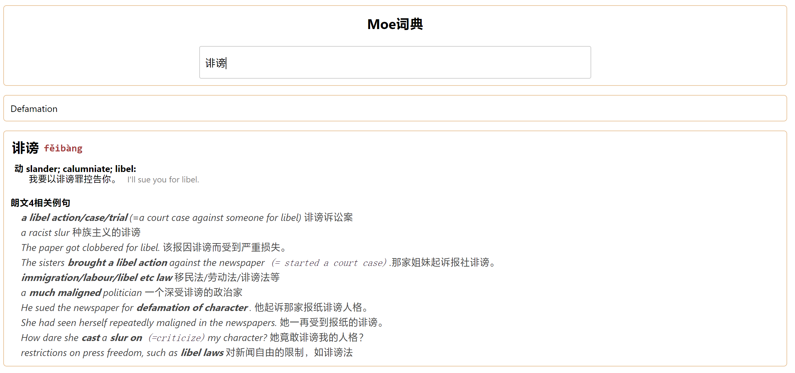

## Mdict Introduction

The Mdict project is a multi-source search web dictionary that integrates MDX dictionaries, es (Elasticsearch) example sentence search, and ai model translation. It is particularly suitable for intranet deployment for learning purposes or for children's education.

Features:

1. Automatically recognizes Chinese/English and selects the corresponding mdx dictionary. Currently, English dictionaries include Oxford 8 and Longman 4, while Chinese dictionaries include Chinese Dictionary 3.
2. English spelling correction and verb tense correction features are attempted.
3. If configured for Chinese, it attempts to search for example sentences from Longman's dictionary using fuzzy search, which is very useful for users with an English foundation.
4. If an ai model is configured, it will use a machine learning model for translation. The results may be rough but can serve as a reference.

## Demo

English Translation

Chinese Translation


## Acknowledgments

1. mdx Parsing

   The MDX dictionary file is a popular dictionary packaging format. Currently, it can only be used in dictionary software such as Mdict, GoldenDict, Eudic, and Deeplearn, and cannot be output to the outside world.
   MDX Server provides a standard HTTP service interface to the outside world by reading dictionary files in MDX and MDD formats.
   The core functionality of MDX Server is referenced from [mdict-analysis](https://bitbucket.org/xwang/mdict-analysis/src/master/) (the referenced version is from 2016; the library has since been updated to support 3.0 mdx files).

2. [Transformer Chinese-English Translation Model Project](https://huggingface.co/Helsinki-NLP)

## Usage

### Local

```bash
# After git clone, if you do not use es and ai, change Enable=false in config.ini
pipenv install
python main.py
```

### Using es and ai

#### es docker setup

```bash
# Start an es container
docker run -d --name elasticsearch -p 9200:9200 -p 9300:9300 -e "discovery.type=single-node" elasticsearch:7.17.1

# Enter the container, download the plugin, and unzip it to the plugins directory
docker exec -it bb228a8a4925 /bin/bash
mkdir ik && cd ik
curl -LJO https://github.com/medcl/elasticsearch-analysis-ik/releases/download/v7.17.1/elasticsearch-analysis-ik-7.17.1.zip
unzip *.zip && cd .. && mv ik plugins
exit

# Exit and restart the container
docker restart elasticsearch

# You can use cerebro to view es
docker run --name cerebro -e CEREBRO_PORT=9001 -p 9001:9001 lmenezes/cerebro
```

### Dockerfile
TDB

## TODO

1. Add Oxford dictionary example sentences to es
2. Find a better ai translation model
