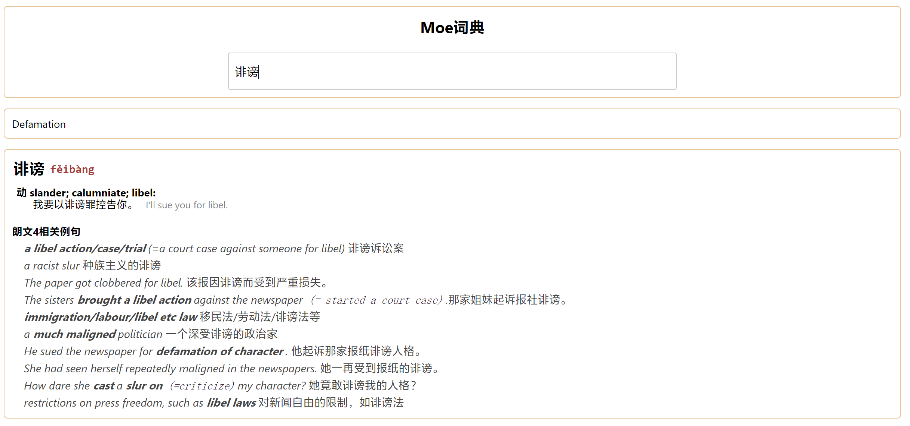

## Mdict说明

Mdict项目是一个糅合了MDX词典、ES例句搜索和AI模型翻译的多源搜索功能Web词典。特别适合部署在内网中学习使用或者给孩子学习使用。

特点：

1. 自动识别中英文选择对应mdx词典，目前英文词典包含牛津8和朗文4，中文词典包含汉语词典3
2. 英文尝试拼写纠错功能，动词时态纠错
3. 如果配置了中文会尝试搜索朗文的例句，模糊搜索，对于有英语基础的同学很有用
4. 如果配置了AI模型，会使用机器学习模型翻译，翻译结果比较粗糙，但是可以参考

## 效果演示

英文翻译

中文翻译


## 感谢项目MDX Server

1. mdx解析

   MDX词典文件是一种流行的词典打包格式。目前只能在 Mdict, GoldenDict, 欧路，深蓝等词典软件中使用，而不能将内容对外输出。
   MDX Server 通过读取 MDX、MDD 格式的词典文件，对外部提供一个标准的 HTTP 服务接口。
   MDX Server 核心功能参考[mdict-analysis](https://bitbucket.org/xwang/mdict-analysis/src/master/)（参考的2016年版本，该库已更新支持3.0 mdx文件）

2. [transformer中英文翻译模型项目](https://huggingface.co/Helsinki-NLP)

## 使用

### 本地

```bash
# git clone后如果不使用es和ai的话,修改config.ini中Enable=false
pipenv install
python main.py
```

### 使用es和ai

#### es docker使用

```bash
# 启动一个es container
docker run -d --name elasticsearch -p 9200:9200 -p 9300:9300 -e "discovery.type=single-node" elasticsearch:7.17.1

# 进入刚才的container 下载插件并解压到plugins
docker exec -it bb228a8a4925 /bin/bash
mkdir ik && cd ik
curl -LJO https://github.com/medcl/elasticsearch-analysis-ik/releases/download/v7.17.1/elasticsearch-analysis-ik-7.17.1.zip
unzip *.zip && cd .. && mv ik plugins
exit

# 退出重启container
docker restart elasticsearch

#可以使用cerebro查看es
docker run --name cerebro -e CEREBRO_PORT=9001 -p 9001:9001 lmenezes/cerebro
```

### Dockerfile
TDB

## TODO

1. 增加牛津词典的例句到ES
2. 寻找更好的AI翻译模型

### how use uv tool
```bash

```